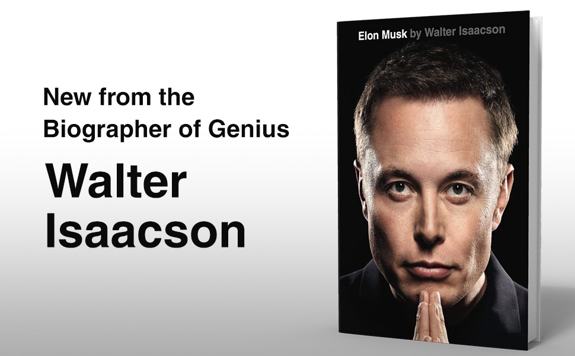

最近主要读了《民主的细节》《芯片战争》和新出的《Elon Musk》几本书。《芯片战争》是在飞机上快速翻了一遍。《民主的细节》是因为前段时间《巨变第二天》特别火，国内还买不到，所以找了一下作者其它著作。《Elon Musk》则是在公司读书活动上白嫖的。

芯片战争
-----

推荐大家读一读，可以快速浏览了解到芯片行业的发展过程。一是可以浅浅的了解到芯片技术和难点，现在的光刻机的难度相当“在地球上用激光打到月球上的一枚硬币”、“制作一个放大到地球大小也没有大坑洼的透镜”。二是了解芯片发展过程中各家公司和中美苏的发展历史和取舍，这儿中文版有删减。三是台湾台积电的芯片代工，有点儿像是计算机分层。在台积电之前如果要生产芯片要自己搞整个完整的流程，台积电则是专注在生产这一层，其它公司专注在设计芯片，把整个芯片流程解耦了。如果现在你要创业搞芯片，可以不用再自己建厂、购买光刻机、培训员工等。

Elon Musk
----

新出的一本马斯克传，挺有意思的。天才都是偏执的，故事的流程都是：提出一个不可能的目标，定一个不可能的deadline，你不听musk的就开除，然后 musk 深入一线对每个细节都关注，然后取得巨大的成功。

民主的细节
----

期望很高，实际上很失望。以为作者是高校教授，这本书会是偏理论引用详实的那类。实际上有点儿故事会，套路都是：美国最近发生了一件有意思的事，在美国是怎么处理的，如果在中国会怎么样，然后总结升华一下。

